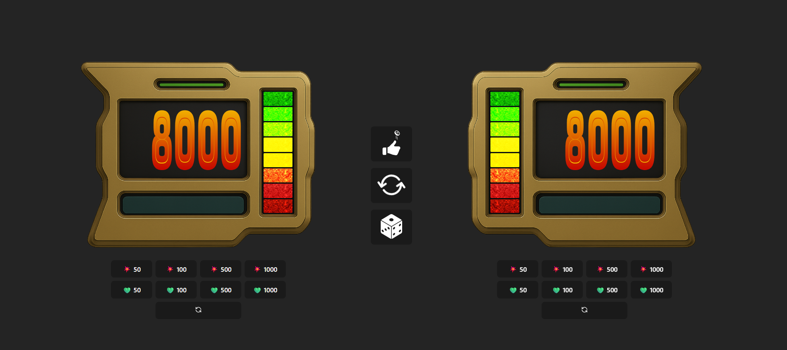
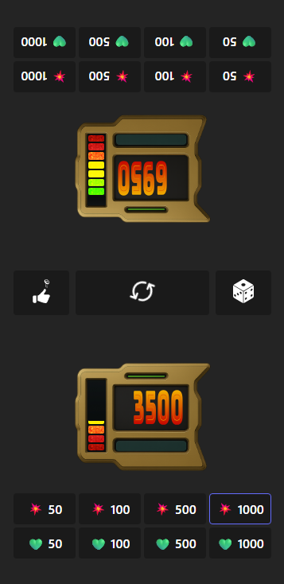

# 🃏 LP Duel Counter – Yu-Gi-Oh! Life Points Tracker

Contador de **Life Points**, inspirado em **Yu-Gi-Oh! GX**, feito com **React + Vite**. Ideal para acompanhar partidas locais. Por enquanto apenas 2 jogadores, animações de dano, reset sincronizado e barra de vida.

---

## 📸 Preview

### 🖥 Desktop

### 📱 Mobile

👉 [https://sillasHead.github.io/yugioh-lp](https://sillasHead.github.io/yugioh-lp)